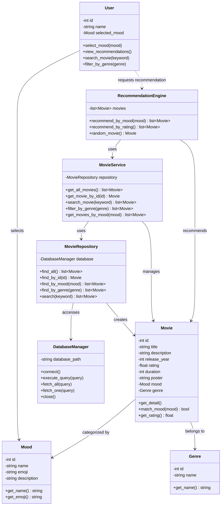

# 🎬 MoodMovie — Class Diagram

เอกสารนี้แสดง **Class Diagram** ของโปรเจกต์ **MoodMovie — ระบบแนะนำหนังตามอารมณ์**  
ออกแบบโดยใช้หลัก **OOAD (Object-Oriented Analysis and Design)** และนำไปพัฒนาด้วย **OOP (Object-Oriented Programming) ใน Python**

---

## 📌 Class Diagram



---

## 🧱 Main Classes

### 1. User

แทนผู้ใช้งานระบบ MoodMovie

**Attributes**

- `id` — รหัสผู้ใช้งาน
- `name` — ชื่อผู้ใช้งาน
- `selected_mood` — อารมณ์ที่ผู้ใช้เลือก

**Methods**

- `select_mood()` — เลือกอารมณ์
- `view_recommendations()` — ดูรายการหนังแนะนำ
- `search_movie()` — ค้นหาหนัง
- `filter_by_genre()` — กรองหนังตาม Genre

---

### 2. Movie

แทนข้อมูลภาพยนตร์แต่ละเรื่อง

**Attributes**

- `id`
- `title`
- `description`
- `release_year`
- `rating`
- `duration`
- `poster`
- `mood`
- `genre`

**Methods**

- `get_detail()` — แสดงรายละเอียดหนัง
- `match_mood()` — ตรวจสอบว่าหนังตรงกับ Mood หรือไม่
- `get_rating()` — คืนค่าคะแนนของหนัง

---

### 3. Mood

แทนอารมณ์ที่ใช้ในการแนะนำภาพยนตร์

ตัวอย่าง Mood:

- 😊 Happy
- 😢 Sad
- ❤️ Romantic
- 🔥 Excited
- 😴 Bored
- 😌 Relaxed

**Attributes**

- `id`
- `name`
- `emoji`
- `description`

---

### 4. Genre

แทนประเภทของภาพยนตร์

ตัวอย่าง:

- Action
- Comedy
- Drama
- Romance
- Sci-Fi
- Mystery
- Animation

---

### 5. RecommendationEngine

เป็น Class หลักสำหรับประมวลผลการแนะนำภาพยนตร์

**Responsibilities**

1. รับ Mood จากผู้ใช้
2. ขอข้อมูลหนังจาก `MovieService`
3. คัดเลือกหนังที่เหมาะสม
4. เรียงลำดับผลลัพธ์
5. ส่งรายการหนังกลับไปแสดงบนเว็บไซต์

**Methods**

- `recommend_by_mood()`
- `recommend_by_rating()`
- `random_movie()`

---

### 6. MovieService

ทำหน้าที่เป็น **Service Layer** จัดการ Business Logic ที่เกี่ยวข้องกับ Movie

**Methods**

- `get_all_movies()`
- `get_movie_by_id()`
- `search_movie()`
- `filter_by_genre()`
- `get_movies_by_mood()`

---

### 7. MovieRepository

ทำหน้าที่เป็นตัวกลางระหว่าง Business Logic และ Database

Repository จะรับผิดชอบเรื่องการค้นหาและดึงข้อมูลภาพยนตร์

**Methods**

- `find_all()`
- `find_by_id()`
- `find_by_mood()`
- `find_by_genre()`
- `search()`

---

### 8. DatabaseManager

ทำหน้าที่จัดการ Database Connection และ SQL Query

ระบบ MoodMovie สามารถใช้ **SQLite** เป็นฐานข้อมูลหลัก

**Methods**

- `connect()`
- `execute_query()`
- `fetch_all()`
- `fetch_one()`
- `close()`

---

# 🔗 Class Relationships

## User → Mood

```text
User selects Mood
```

ผู้ใช้เลือกอารมณ์ก่อนขอคำแนะนำภาพยนตร์

---

## Movie → Mood

```text
Movie is categorized by Mood
```

ภาพยนตร์หนึ่งเรื่องจะถูกกำหนด Mood เพื่อใช้ในการ Recommendation

ตัวอย่าง:

```text
Interstellar → Excited
About Time   → Romantic
Toy Story    → Happy
```

---

## Movie → Genre

```text
Movie belongs to Genre
```

ตัวอย่าง:

```text
Interstellar → Sci-Fi
About Time   → Romance
Knives Out   → Mystery
```

---

## User → RecommendationEngine

```text
User
 ↓
RecommendationEngine
```

User ส่ง Mood ให้ Recommendation Engine เพื่อขอรายการหนังแนะนำ

---

## RecommendationEngine → MovieService

```text
RecommendationEngine
        ↓
MovieService
```

Recommendation Engine ไม่เข้าถึง Database โดยตรง แต่เรียกใช้งานผ่าน Service Layer

---

## MovieService → MovieRepository

```text
MovieService
      ↓
MovieRepository
```

MovieService ส่งคำขอข้อมูลไปยัง Repository

---

## MovieRepository → DatabaseManager

```text
MovieRepository
       ↓
DatabaseManager
       ↓
SQLite
```

Repository ใช้ DatabaseManager เพื่อ Query ข้อมูลจาก SQLite

---

# 🔄 Object Interaction

Flow ตัวอย่างเมื่อ User เลือก Mood = `Happy`

```text
User
 │
 │ select_mood("Happy")
 ▼
RecommendationEngine
 │
 │ recommend_by_mood("Happy")
 ▼
MovieService
 │
 │ get_movies_by_mood("Happy")
 ▼
MovieRepository
 │
 │ find_by_mood("Happy")
 ▼
DatabaseManager
 │
 ▼
SQLite Database
 │
 │ Movie Data
 ▼
MovieRepository
 │
 ▼
MovieService
 │
 ▼
RecommendationEngine
 │
 ▼
Recommended Movie List
 │
 ▼
User
```

---

# 🧠 OOAD Responsibility Overview

| Class | Responsibility |
|---|---|
| `User` | จัดการการกระทำของผู้ใช้ |
| `Movie` | เก็บข้อมูลและพฤติกรรมของภาพยนตร์ |
| `Mood` | แทนอารมณ์ของผู้ใช้ |
| `Genre` | แทนประเภทภาพยนตร์ |
| `RecommendationEngine` | ประมวลผลการแนะนำ |
| `MovieService` | จัดการ Business Logic |
| `MovieRepository` | ดึงและค้นหาข้อมูล Movie |
| `DatabaseManager` | เชื่อมต่อและจัดการ Database |

---

# 🏗️ Layered Architecture

Class Diagram นี้สามารถแบ่งเป็น Layer ได้ดังนี้

```text
┌───────────────────────────────┐
│      Presentation Layer       │
│                               │
│ HTML / CSS / JavaScript       │
└───────────────┬───────────────┘
                │
                ▼
┌───────────────────────────────┐
│       Controller Layer        │
│                               │
│ Flask Routes                  │
└───────────────┬───────────────┘
                │
                ▼
┌───────────────────────────────┐
│        Service Layer          │
│                               │
│ RecommendationEngine          │
│ MovieService                  │
└───────────────┬───────────────┘
                │
                ▼
┌───────────────────────────────┐
│         Model Layer           │
│                               │
│ Movie                         │
│ Mood                          │
│ Genre                         │
│ User                          │
└───────────────┬───────────────┘
                │
                ▼
┌───────────────────────────────┐
│       Data Access Layer       │
│                               │
│ MovieRepository               │
│ DatabaseManager               │
└───────────────┬───────────────┘
                │
                ▼
┌───────────────────────────────┐
│         SQLite DB             │
└───────────────────────────────┘
```

---

# 🎓 OOP Concepts Represented

Class Diagram นี้แสดงแนวคิด OOP หลัก ได้แก่

### Class & Object

เช่น

```python
movie = Movie(...)
mood = Mood(...)
```

### Encapsulation

แต่ละ Class รับผิดชอบข้อมูลและ Method ของตนเอง

### Abstraction

`RecommendationEngine` ซ่อนรายละเอียดของ Algorithm การแนะนำหนัง

### Separation of Concerns

ระบบแบ่งหน้าที่เป็น

```text
Model
Service
Repository
Database
Controller
View
```

ทำให้ Source Code มีโครงสร้างชัดเจนและแก้ไขได้ง่าย

---

# ✅ Recommended Mini Project Scope

สำหรับเวอร์ชัน Mini Project แนะนำให้ใช้ Class หลักอย่างน้อย:

```text
Movie
Mood
Genre
RecommendationEngine
MovieService
DatabaseManager
```

หากต้องการแสดง Architecture ที่ชัดเจนขึ้น สามารถเพิ่ม:

```text
User
MovieRepository
```

โดยยังไม่จำเป็นต้องเพิ่มระบบ Login หรือ User Account จริง

---

## 🎬 MoodMovie

> **Find a movie that matches your mood.**

Built with Python + Flask + OOP + OOAD.
