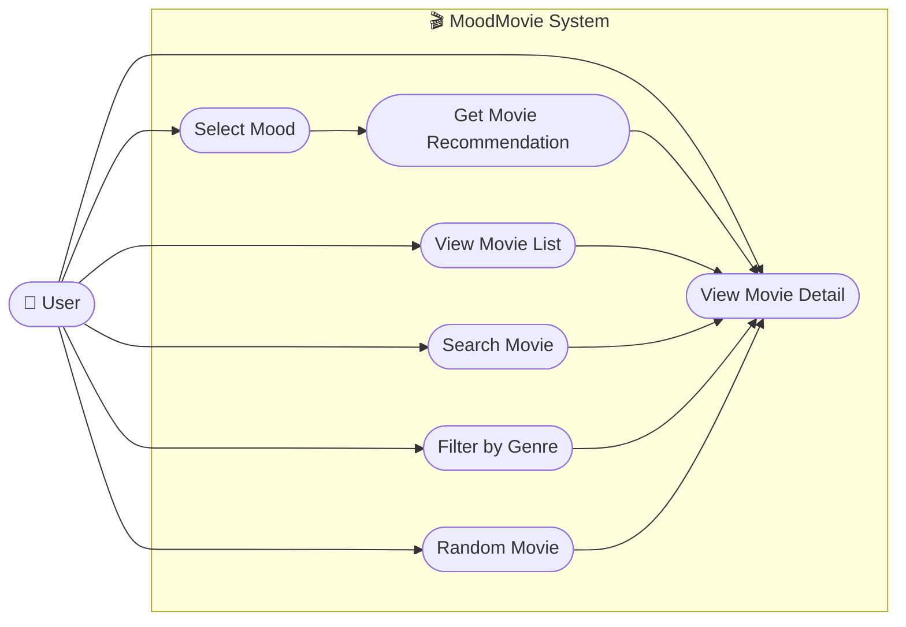

# 🎬 MoodMovie — Use Case Diagram

เอกสารนี้แสดง **Use Case Diagram** ของโปรเจกต์ **MoodMovie — ระบบแนะนำหนังตามอารมณ์**  
ออกแบบตามแนวคิด **OOAD (Object-Oriented Analysis and Design)** เพื่ออธิบายว่าผู้ใช้งานสามารถทำอะไรกับระบบได้บ้าง

---

# 📌 System Overview

MoodMovie เป็น Web Application สำหรับแนะนำภาพยนตร์ตามอารมณ์ของผู้ใช้

ผู้ใช้สามารถเลือกอารมณ์ เช่น

- 😊 Happy
- 😢 Sad
- ❤️ Romantic
- 🔥 Excited
- 😴 Bored
- 😌 Relaxed

จากนั้นระบบจะวิเคราะห์ Mood ที่เลือกและแนะนำภาพยนตร์ที่เหมาะสม

---

# 👤 Actor

Actor หลักของระบบคือ

## User

ผู้ใช้งานทั่วไปที่เข้ามาใช้เว็บไซต์ MoodMovie

User สามารถทำสิ่งต่อไปนี้ได้

- เลือก Mood
- รับคำแนะนำภาพยนตร์
- ดูรายการภาพยนตร์
- ดูรายละเอียดภาพยนตร์
- ค้นหาภาพยนตร์
- กรองภาพยนตร์ตาม Genre
- สุ่มภาพยนตร์

---

# 🎯 Main Use Cases

Use Case หลักของระบบประกอบด้วย

1. Select Mood
2. Get Movie Recommendation
3. View Movie List
4. View Movie Detail
5. Search Movie
6. Filter by Genre
7. Random Movie

---

# 🗺️ Use Case Diagram

> หมายเหตุ: Mermaid ยังไม่มี Use Case Diagram syntax โดยตรง  
> ดังนั้น Diagram ด้านล่างใช้ `flowchart` เพื่อจำลอง Use Case Diagram ให้แสดงผลบน GitHub และ Markdown ที่รองรับ Mermaid ได้



---

# 🔗 Use Case Relationship

## 1. Select Mood → Get Movie Recommendation

เมื่อ User เลือก Mood ระบบจะทำการประมวลผลเพื่อแนะนำภาพยนตร์

```text
User
 ↓
Select Mood
 ↓
Get Movie Recommendation
```

---

## 2. Get Movie Recommendation → View Movie Detail

เมื่อระบบแนะนำภาพยนตร์แล้ว User สามารถเลือกดูรายละเอียดภาพยนตร์ได้

```text
Get Movie Recommendation
        ↓
View Movie Detail
```

---

## 3. View Movie List → View Movie Detail

User สามารถเปิดรายการภาพยนตร์ทั้งหมดและเลือกภาพยนตร์ที่ต้องการดูรายละเอียด

---

## 4. Search Movie → View Movie Detail

เมื่อ User ค้นหาภาพยนตร์ ระบบจะแสดงผลลัพธ์ และสามารถเลือกดูรายละเอียดได้

---

## 5. Filter by Genre → View Movie Detail

User สามารถกรองภาพยนตร์ตาม Genre เช่น

```text
Action
Comedy
Drama
Romance
Sci-Fi
Mystery
Animation
```

แล้วเลือกดูรายละเอียดของภาพยนตร์แต่ละเรื่องได้

---

## 6. Random Movie → View Movie Detail

กรณีที่ User ไม่รู้ว่าจะดูเรื่องไหน สามารถใช้ฟังก์ชัน

```text
🎲 Surprise Me
```

เพื่อให้ระบบสุ่มภาพยนตร์ให้

---

# 📋 Use Case Specification

---

## UC-01: Select Mood

### Actor
User

### Description
ผู้ใช้เลือกอารมณ์ปัจจุบันเพื่อใช้เป็นข้อมูลในการแนะนำภาพยนตร์

### Preconditions
- User เปิดหน้า Homepage ของ MoodMovie แล้ว
- ระบบแสดงรายการ Mood ให้เลือก

### Main Flow

```text
1. User เปิดหน้า Homepage
2. ระบบแสดง Mood ที่รองรับ
3. User เลือก Mood
4. ระบบรับค่า Mood
5. ระบบส่ง Mood ไปยัง Recommendation Engine
6. ระบบค้นหาภาพยนตร์ที่ตรงกับ Mood
7. ระบบแสดงรายการภาพยนตร์แนะนำ
```

### Postconditions
ระบบแสดง Recommendation ที่สัมพันธ์กับ Mood ของ User

### Example

```text
User selects:

😊 Happy

System recommends:

Toy Story
Paddington
The Grand Budapest Hotel
```

---

# UC-02: Get Movie Recommendation

### Actor
User

### Description
ระบบแนะนำภาพยนตร์ให้กับ User ตาม Mood ที่เลือก

### Preconditions
- User เลือก Mood แล้ว
- Database มีข้อมูลภาพยนตร์

### Main Flow

```text
1. ระบบรับ Mood จาก User
2. RecommendationEngine ประมวลผล Mood
3. MovieService ขอข้อมูล Movie
4. ระบบค้นหาภาพยนตร์ที่ตรงกับ Mood
5. ระบบเรียงลำดับผลลัพธ์
6. ระบบส่งรายการ Movie กลับ
7. หน้าเว็บแสดง Recommendation
```

### Postconditions
User เห็นรายการภาพยนตร์ที่ระบบแนะนำ

---

# UC-03: View Movie List

### Actor
User

### Description
User สามารถดูภาพยนตร์ทั้งหมดที่มีอยู่ในระบบ

### Preconditions
- User เข้าสู่เว็บไซต์ MoodMovie
- Database มีข้อมูล Movie

### Main Flow

```text
1. User เลือกเมนู Movies
2. Browser ส่ง GET /movies
3. Flask Route รับ Request
4. MovieService ดึงข้อมูลภาพยนตร์
5. Database ส่งข้อมูลกลับ
6. ระบบแสดง Movie Cards
```

### Postconditions
User เห็นรายการภาพยนตร์ทั้งหมด

---

# UC-04: View Movie Detail

### Actor
User

### Description
User สามารถดูข้อมูลรายละเอียดของภาพยนตร์แต่ละเรื่อง

### Preconditions
- User เห็นรายการ Movie แล้ว

### Main Flow

```text
1. User คลิก Movie Card
2. Browser ส่ง Movie ID
3. Flask รับ Movie ID
4. MovieService ค้นหา Movie
5. ระบบดึงข้อมูลจาก Database
6. ระบบแสดง Movie Detail
```

### Movie Detail ที่แสดง

- Poster
- Movie Title
- Description
- Release Year
- Rating
- Duration
- Genre
- Mood

### Postconditions
User เห็นรายละเอียดของภาพยนตร์ที่เลือก

---

# UC-05: Search Movie

### Actor
User

### Description
User สามารถค้นหาภาพยนตร์จากชื่อหรือ Keyword

### Preconditions
- User เปิดหน้าเว็บไซต์แล้ว

### Main Flow

```text
1. User กรอก Keyword
2. User กด Search
3. ระบบรับ Keyword
4. MovieService ค้นหาข้อมูล
5. ระบบแสดง Search Results
```

### Alternative Flow

ถ้าไม่พบ Movie

```text
No movies found.
Try another keyword.
```

### Postconditions
ระบบแสดงรายการภาพยนตร์ที่ตรงกับคำค้นหา

---

# UC-06: Filter by Genre

### Actor
User

### Description
User สามารถกรองภาพยนตร์ตาม Genre ได้

### Preconditions
- ระบบมีข้อมูล Genre
- ระบบมี Movie ที่เชื่อมกับ Genre

### Main Flow

```text
1. User เปิด Movie List
2. User เลือก Genre
3. ระบบรับค่า Genre
4. MovieService กรอง Movie
5. ระบบแสดง Movie ที่ตรงกับ Genre
```

### Example

```text
Selected Genre:

Sci-Fi

Result:

Interstellar
Inception
The Martian
```

### Postconditions
User เห็นเฉพาะภาพยนตร์ที่ตรงกับ Genre ที่เลือก

---

# UC-07: Random Movie

### Actor
User

### Description
User สามารถให้ระบบสุ่มภาพยนตร์เพื่อช่วยตัดสินใจได้

### Preconditions
- Database มีข้อมูล Movie อย่างน้อย 1 เรื่อง

### Main Flow

```text
1. User คลิก Surprise Me
2. ระบบเรียก Random Movie Function
3. RecommendationEngine สุ่ม Movie
4. ระบบเลือก Movie 1 เรื่อง
5. ระบบแสดง Movie Detail
```

### Postconditions
User ได้รับภาพยนตร์แบบสุ่ม 1 เรื่อง

---

# 🔄 Overall Use Case Flow

```text
START
  ↓
Open MoodMovie
  ↓
Choose Action
  │
  ├── Select Mood
  │      ↓
  │   Get Recommendation
  │      ↓
  │   View Movie Detail
  │
  ├── View Movie List
  │      ↓
  │   View Movie Detail
  │
  ├── Search Movie
  │      ↓
  │   View Movie Detail
  │
  ├── Filter by Genre
  │      ↓
  │   View Movie Detail
  │
  └── Random Movie
         ↓
      View Movie Detail
         ↓
        END
```

---

# 🧠 Use Case and System Components

แต่ละ Use Case เชื่อมโยงกับ Class หรือ Component ของระบบดังนี้

| Use Case | Main Class / Component |
|---|---|
| Select Mood | `Mood` |
| Get Movie Recommendation | `RecommendationEngine` |
| View Movie List | `MovieService` |
| View Movie Detail | `Movie`, `MovieService` |
| Search Movie | `MovieService`, `MovieRepository` |
| Filter by Genre | `Genre`, `MovieService` |
| Random Movie | `RecommendationEngine` |
| Database Access | `MovieRepository`, `DatabaseManager` |

---

# 🏗️ Use Case to Architecture Flow

```text
User
 ↓
HTML / CSS / JavaScript
 ↓
Flask Route
 ↓
Service Layer
 ↓
RecommendationEngine / MovieService
 ↓
Repository
 ↓
Database
 ↓
Return Result
 ↓
HTML Template
 ↓
User
```

---

# 🎓 OOAD Analysis

จาก Use Case สามารถนำไปวิเคราะห์ Object หลักได้ดังนี้

```text
User
Movie
Mood
Genre
RecommendationEngine
MovieService
MovieRepository
DatabaseManager
```

Use Case จึงเป็นจุดเริ่มต้นในการกำหนด

- Class
- Attribute
- Method
- Responsibility
- Relationship
- System Flow

ก่อนนำไปสร้าง Class Diagram และพัฒนาด้วย OOP

---

# ✅ Mini Project Scope

เพื่อให้เหมาะกับ Mini Project ระบบ MoodMovie เวอร์ชันแรกจะรองรับ

```text
✓ Select Mood
✓ Movie Recommendation
✓ Movie List
✓ Movie Detail
✓ Search Movie
✓ Filter by Genre
✓ Random Movie
```

ยังไม่รวม

```text
✗ User Login
✗ Registration
✗ Payment
✗ Streaming
✗ Advanced AI
✗ Machine Learning
✗ Social Features
```

---

# 📌 Summary

Use Case Diagram ของ MoodMovie มี Actor หลักเพียงหนึ่ง Actor คือ

```text
User
```

และมี Use Case หลักทั้งหมด 7 รายการ

```text
1. Select Mood
2. Get Movie Recommendation
3. View Movie List
4. View Movie Detail
5. Search Movie
6. Filter by Genre
7. Random Movie
```

Use Case เหล่านี้ครอบคลุมการทำงานหลักของระบบตั้งแต่การเลือกอารมณ์ การค้นหาและแนะนำภาพยนตร์ ไปจนถึงการดูรายละเอียดของภาพยนตร์

---

## 🎬 MoodMovie

> **Find a movie that matches your mood.**

Built with Python + Flask + OOAD + OOP.
